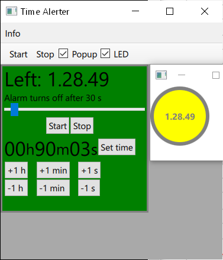

# Time Alerter (alert timer)

## The purpose of the app
The app provides a user interface for setting an alert time.
The alert shows on the app window.
Planned alerts include sound or SteelSeries device illumination.
 
## Work in progress
These features are working on the windowed application:
- Setting the alert time by typing the hours, minutes and seconds. The digits can be incremented and decremented by buttons.
- Stopping the alert timer countdown with buttons.
- Showing the time remaining and counting down the digits of hours, minutes and seconds.
- Showing a popup window at the alert time. The window has the text "ALARM" moving back and forth and a button to stop the alert.
- The popup can be disabled.
- If the popup is enabled and the app is not on the foreground, it alerts the user by e.g. flashing the window icon at the taskbar.
- Setting the duration of the alarm with a slider (e.g. how long the popup window is visible).
- An extra window that either reads "OFF" when timer is off, or shows the remaining time when counting down, or has the text "ALARM" pulsating at the alert time.
- Settings menu: item that toggles the extra window visibility.
- Settings menu: item for choosing a sound file for the alarm.
- Settings menu: items for choosing a color for the controls' background rectangle.
- A popup that asks to choose a sound file at program start.
- Sound alarm: can be disabled or enabled.
- Sound alarm: a popup image is shown as the sound plays and it changes when playing ends.
- Information menu with the items "About" and "License".

Different alert execution types are under consideration: playing a sound, changing [SteelSeries device illumination](https://github.com/SteelSeries/gamesense-sdk) or popping up other notification.
The use of SteelSeries illumination is an incomplete feature.
(Causes are keyboard disconnection issues when using USB hubs and GameSense's lack of support for non-RGB mice.)

A preview image of the user interface when the time is running:

## Instructions - development
Prerequisite for the development version is installation of [Qt 6.4 (or higher)](https://www.qt.io/get-started) for desktop application development. The components Qt Quick and Qt Network are required. Components, including Qt sources, can be installed with the maintenance tool found in the Qt install directory.

1. Get the app source files,
2. start Qt Creator and open CMakeLists.txt with it,
3. build the project by clicking the hammer icon,
4. run the app by clicking the green triangle.

## License and download
An executable file download for Windows or other OS may eventually be considered, if release quality is reached and the licensing requirements are met. The license will be LGPL or GPL as dictated by [open source Qt licensing](https://www.qt.io/licensing/).
