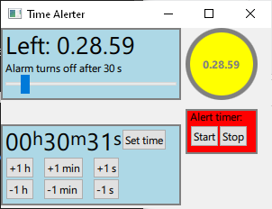

# Time Alerter (alert timer)

The app provides a user interface for setting an alert time. The alert shows on SteelSeries device illumination or on PC screen or plays a sound.
 
## Work in progress
These features are working on the windowed application:
- Setting the alert time by typing the hours, minutes and seconds. The digits can be incremented and decremented by buttons.
- Buttons start and stop the alert timer countdown.
- The time remaining is shown counting down the digits of hours, minutes and seconds.
- A popup window is shown at the alert time. If the app is not on the foreground, it alerts the user by e.g. flashing the window icon at the taskbar.
- The duration of the alarm (e.g. how long the popup window is visible) can be set with a slider from 1 to 300 seconds.

Different alert execution types are under consideration: playing a sound, changing [SteelSeries device illumination](https://github.com/SteelSeries/gamesense-sdk) or popping up other notification.

A preview image of the not so cute user interface when the time is running:

## Instructions - development
Prerequisite for the development version is installation of [Qt 6.4 (or higher)](https://www.qt.io/get-started) for desktop application development. The components Qt Quick and Qt Network are required.

1. Get the app source files,
2. start Qt Creator and open CMakeLists.txt with it,
3. build the project by clicking the hammer icon,
4. run the app by clicking the green triangle.

## License and download
An executable file for Windows or other OS may eventually be available if release quality is reached. The license will be LGPL or GPL as dictated by [open source Qt licensing](https://www.qt.io/licensing/).
